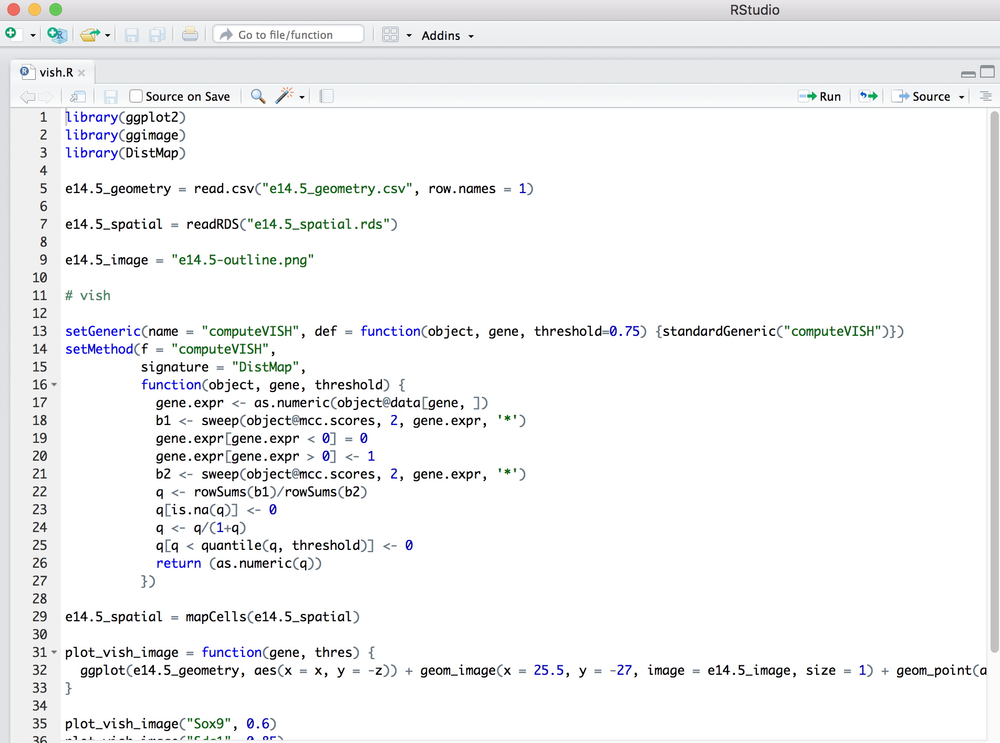
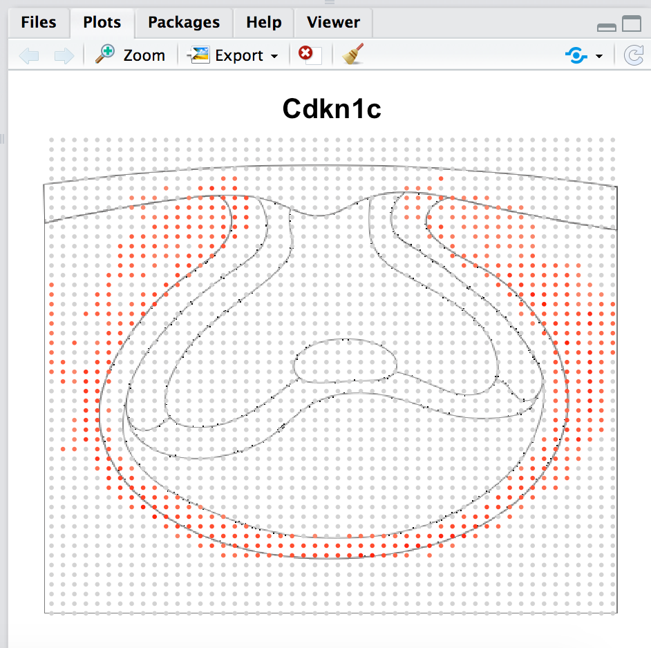

# ToothAtlas: How to use our data to spatially map expressed genes
## About
Spatial mappings of gene expression at E14.5 was made using DistMap method ([Karaiskos et al., 2017](http://science.sciencemag.org/content/358/6360/194)). Briefly, Existing immunohistochemistry (IHC), immuno-fluorescence (IF) and in situ hybridization (ISH) data for dental marker genes (in total 103 genes used in E14.5 spatial mapping) were quality-checked before further extracted from published documents for downstream digitalization. Digitalized spatial matrixes were drawn according to the specific expression pattern of those digitalized dental markers. Gene expression profile of each cell from scRNA-seq dataset was then processed and mapped to the virtual tooth. Specific localization of expressed genes could then be predicted.
## Document Description
- **vish.R**  The Script for processing data to spatially map expressed genes
- **e14.5_geometry.csv** The file used to create the coordinates
- **e14.5_spatial.rds** The object for processing and mapping to the virtual tooth. Data from Mouse E14.5-days on GSE162413.
## Quick Start Guide
In short,users need to download the files, then open the  `vish.R` in rstudio and run the script step by step.

Users can visualize the genes they want to predict by changing the gene names
> plot_vish_image("Cdkn1c", 0.8)       
> 'Cdkn1c' can be replaced by other gene names

